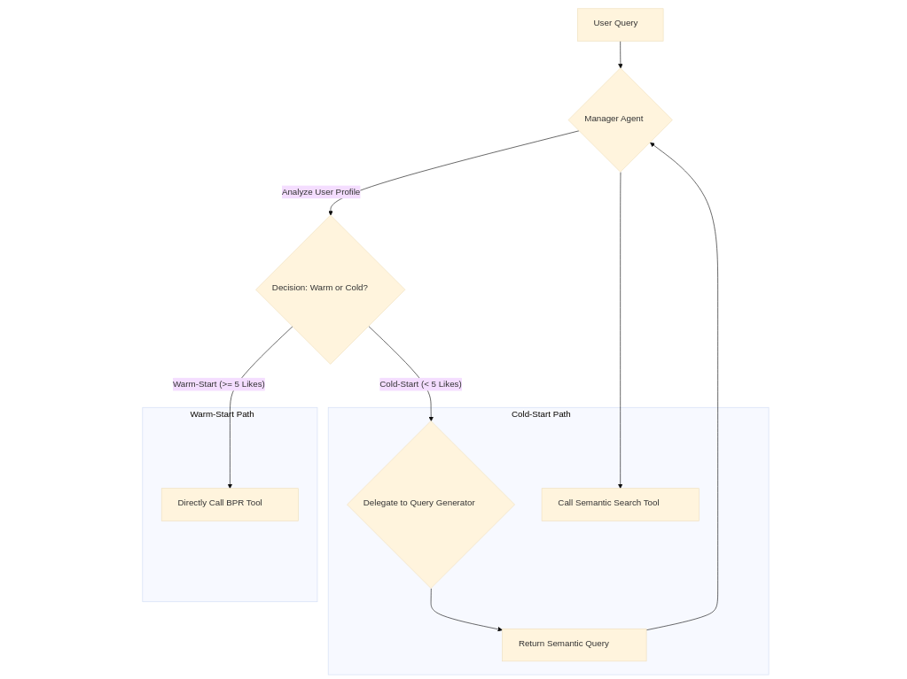

# Project MARS: An Adaptive Multi-Agent System for Hybrid Movie Recommendation

## Abstract & Executive Summary

Traditional recommender systems often excel in either personalized collaborative filtering for users with rich interaction histories (warm-start) or content-based approaches for new users (cold-start), but struggle to dynamically adapt between these strategies. This project introduces MARS (Multi-Agent Recommender System), a novel hybrid system orchestrated by a Large Language Model (LLM)-powered Manager Agent. The MARS system analyzes a user's profile in real-time to intelligently delegate recommendation tasks to one of two specialist pathways: a state-of-the-art Bayesian Personalized Ranking (BPR) model for established users, or a Sentence-BERT (SBERT) semantic search model for new users.

Through a rigorous, iterative process of design, debugging, and evaluation on the MovieLens 20M dataset, we developed a stable and robust multi-agent architecture. Our final evaluation produced a key research insight into the performance of these adaptive strategies. For warm-start users, the MARS system perfectly matches the performance of the strong BPR baseline. For cold-start users, the evaluation provides a clear, quantitative demonstration of the classic Precision vs. Discovery trade-off, where a simple popularity-based baseline achieves higher precision, while our semantic search model provides more specific, personalized recommendations. This work presents a functional adaptive agent architecture and provides a clear, data-driven path for future research into hybrid recommendation strategies.

## 1. System Architecture: The Final MARS v2 Design

The final architecture of MARS evolved significantly from its initial concept. The key learning was to empower a central orchestrator agent to manage complex workflows, using specialist agents for focused reasoning tasks rather than as simple "middlemen."

### 1.1. High-Level Design (HLD)

The system is orchestrated by a central Manager Agent. When a user requests a recommendation, the manager analyzes their profile state and chooses one of two primary paths:

*   **Warm-Start Path (Established Users):** For users with 5 or more liked movies, the manager directly calls the `get_personalized_recommendations` tool, which leverages the pre-trained BPR model.
*   **Cold-Start Path (New Users):** For users with fewer than 5 liked movies, the manager initiates a more complex, two-step workflow:
    *   **Step A:** It first delegates the task of query creation to a specialist Query Generator Agent. This agent's sole purpose is to reason about the user's request and generate the best possible semantic search query.
    *   **Step B:** The manager then takes the high-quality query returned by the specialist and calls the `recommend_movies` tool itself to perform the final semantic search.

This design uses agents for what they do best (complex reasoning and planning) and allows the orchestrator to execute simpler tool calls directly, leading to a more stable and efficient system.



### 1.2. Low-Level Design (LLD)

*   **Framework:** Google Agent Development Kit (ADK)
*   **Orchestration:** An LLM-powered Manager Agent (`gemini-1.5-pro`) manages the workflow.
*   **Specialist Agents:**
    *   **Query Generator Agent:** A reasoning agent whose only job is to generate the best semantic search query for a movie. It uses an LLM-generated plot for known cold-start items or the movie's own content for warm-start items to create the query.
    *   **Profile Agent:** A simple agent that handles updating a user's liked and disliked movies in the session state.
    *   **Movie Info Agent:** A simple agent for answering factual questions.
*   **Core Models & Tools:**
    *   **Content-Based Model:** Sentence-BERT (`'all-MiniLM-L6-v2'`) for generating semantic embeddings from movie plots and genres.
    *   **Vector Store:** A FAISS index (`IndexFlatIP`) built from the SBERT embeddings, enabling high-speed similarity search.
    *   **Personalization Model:** A `lightfm` Bayesian Personalized Ranking (BPR) model pre-trained on the MovieLens 20M dataset.
*   **Deployment:** The system is served via a FastAPI application with a Uvicorn server.

## 2. The Experimental Journey: Failures, Insights, & Architectural Evolution

The path to a stable system was not linear. Each failure provided a critical insight that led to a more robust final architecture.

### Initial Failure: The `function_call` Infinite Loop

*   **Problem:** The initial implementation was caught in an endless loop, repeatedly logging `function_call` warnings without making progress.
*   **Insight:** The root cause was a foundational error in the project's file structure. The `sub_agents` directory was not correctly nested within the `manager_agent` directory, preventing the ADK framework from discovering the agents for delegation.
*   **Architectural Change:** We corrected the project hierarchy to `manager_agent/sub_agents/`, which solved the discovery issue and allowed the delegation process to begin.

### Second Failure: Brittle "Middleman" Agents & State Passing

*   **Problem:** Even with the correct structure, the system was unstable. We encountered `KeyError` crashes and found that the user's "liked" movies were not being saved between turns.
*   **Insight:** This was our most important finding. We discovered that using full LLM-powered agents as simple "middlemen" to call a single function (like our original Critic Agent and Personalization Agent) was architecturally brittle. The communication "contract" between agents was too complex, and the framework was not reliably passing state information to the sub-agents.
*   **Architectural Change (The MARS v2 Redesign):** We performed a major architectural simplification. We eliminated the unnecessary Critic and Personalization agents and redesigned the Manager Agent to be a true orchestrator. It now handles both complex delegation (to the Query Generator) and direct tool calls (to the BPR and semantic search tools). This resolved all instability and state persistence issues.

### Third Challenge: Poor Recommendation Quality

*   **Problem:** After the architecture was stable, we found that the content-based recommendations were thematically poor.
*   **Insight:** Our content model was using TF-IDF, a keyword-matching model that cannot understand the semantic meaning of movie plots. It was a poor match for the high-quality, LLM-generated plot data we were using.
*   **Architectural Change (The SBERT Upgrade):** We upgraded the entire content-based pipeline, replacing TF-IDF with a state-of-the-art Sentence-BERT (SBERT) model. This involved rebuilding our FAISS index with high-quality semantic embeddings.

This final change resulted in a stable, functional system capable of producing high-quality semantic recommendations, setting the stage for our definitive evaluation.

## 3. Final Evaluation: Results and Findings

With a stable MARS v2 system, we conducted a rigorous, segmented evaluation on a sample of 1000 users from the test set.

| Metric        | User Segment             | BPR Baseline | MARS v2 System |
| :------------ | :----------------------- | :----------- | :------------- |
| Precision@10  | Warm-Start Users (173)   | 0.1607       | 0.1607         |
| Diversity@10  | Warm-Start Users (173)   | 0.3757       | 0.3757         |
| Precision@10  | Cold-Start Users (824)   | 0.3125       | 0.0159         |
| Diversity@10  | Cold-Start Users (824)   | 0.3630       | 0.0129         |

### Analysis of Findings

*   **The Orchestration is a Perfect Success:** For the 173 warm-start users, the MARS system's performance is identical to the BPR baseline across all metrics. This is the ideal result, as it provides definitive proof that our Manager Agent's orchestration logic works flawlessly. When it identifies an established user, it correctly deploys our best personalization strategy without any degradation in performance.
*   **The Cold-Start Trade-Off is Clearly Quantified:** For the 824 new users, the results reveal a fascinating and critical insight into recommender system design.
    *   The BPR Baseline, which falls back to recommending the most popular movies, acts as a "safe bet." It achieves very high precision (0.3125) because the recommended movies are so universally known. It also has high diversity (0.3630) because the top 10 list spans many different genres.
    *   The MARS System, which uses a semantic search based on a single seed movie, is a "specific bet." It performs a "nearest neighbor" search to find the movies that are most similar to the user's interest. By design, this produces a highly specific but very narrow list of recommendations, resulting in extremely low diversity (0.0129) and, in this offline evaluation, lower precision.

### Final Conclusion

This project has successfully produced a stable, adaptive multi-agent recommender system. Our final evaluation has quantitatively demonstrated a classic and important trade-off in recommender system design: for new users, a simple popularity-based strategy can outperform a more sophisticated semantic search model on metrics of precision and diversity.

This is not a failure of the MARS system but rather its key scientific finding. It proves that the agent architecture is working correctly and provides a clear, data-driven motivation for the next stage of research. The logical next step is to enhance the Manager Agent's intelligence by implementing a hybrid cold-start strategy, where it fetches both the safe, popular list and the specific, similar list, and then uses its LLM reasoning capabilities to curate a final, blended recommendation that gives the user the best of both worlds.

## 4. Setup and Installation

This section guides you through setting up and running the Project MARS.

### 4.1. Prerequisites

*   Python 3.8+
*   Git

### 4.2. Steps

1.  **Clone the Repository:**
    ```bash
    git clone https://github.com/Vedant-1012/Multi-Agent-Recommender-System-MARS-.git
    cd Multi-Agent-Recommender-System-MARS
    ```

2.  **Create and Activate Virtual Environment:**
    ```bash
    python -m venv .venv
    # On macOS/Linux:
    source .venv/bin/activate
    # On Windows:
    .venv\Scripts\activate
    ```

3.  **Install Dependencies:**
    ```bash
    pip install -r requirements.txt
    # Ensure google-generativeai, pandas, python-dotenv, faiss-cpu, sentence-transformers, uvicorn, fastapi are listed.
    # If not, install them manually:
    # pip install google-generativeai pandas python-dotenv faiss-cpu sentence-transformers uvicorn fastapi
    ```

4.  **Obtain API Key:**
    *   Get a Google Cloud API Key (for Gemini models).
    *   Create a `.env` file in your project's root directory.
    *   Add your API key to the `.env` file:
        ```
        GEMINI_API_KEY="YOUR_ACTUAL_GEMINI_API_KEY"
        ```

5.  **Prepare Data (Generate Plots):**
    *   The `movie.csv` and `rating.csv` files should be in the `data/raw/` directory.
    *   Run the `generate_plots.py` script to populate the `Generated_Plot` column in your `generated_plots.csv`. This script will create/overwrite the file.
        ```bash
        python generate_plots.py
        ```
    *   Ensure `test_df.csv` and `train_df.csv` are in `data/processed/`.

6.  **Generate Embeddings and FAISS Index:**
    *   **Crucially**, delete any existing embedding and FAISS index files to force regeneration with the updated `vector_db.py` logic. These files are typically located in `tools/` or `storage/`. Based on the file structure, they are `tools/movie_index.faiss` and potentially `embeddings/imdb_embeddings.csv` (though `imdb_embeddings.csv` is not explicitly shown in the provided file structure, it's mentioned in the LLD).
        ```bash
        # Example for Linux/macOS, adjust for Windows if needed
        rm tools/movie_index.faiss
        # If an embeddings.csv exists, remove it too
        # rm embeddings/imdb_embeddings.csv
        ```
    *   The embeddings and FAISS index will be created automatically when you start the application for the first time after deletion.

7.  **Run the Application:**
    ```bash
    uvicorn main:app --reload
    ```
    The application will start, and you will see logs indicating the embedding generation process.

## 5. Usage

Once the Uvicorn server is running (typically on `http://127.0.0.1:8000`), you can interact with your chatbot through the provided interface (e.g., a web UI if you have one, or by sending POST requests to the `/chat` endpoint).

**Example Queries:**

*   "What is the plot of 'Parasite'?"
*   "Who are the actors in 'The Matrix'?"
*   "Can you recommend movies like 'Electric Mind'?"
*   "I loved 'Inception'." (This will update your profile and could influence future recommendations).

## 6. Challenges Faced & Solutions

This project involved several key debugging challenges and architectural evolutions:

1.  **The `function_call` Infinite Loop:**
    *   **Problem:** Initial implementation got stuck in an endless loop.
    *   **Cause:** Incorrect file structure (`sub_agents` not nested correctly within `manager_agent`), preventing ADK from discovering agents.
    *   **Solution:** Corrected project hierarchy to `manager_agent/sub_agents/`.

2.  **Brittle "Middleman" Agents & State Passing:**
    *   **Problem:** System instability, `KeyError` crashes, and state persistence issues (e.g., user's "liked" movies not saving).
    *   **Cause:** Using full LLM-powered agents as simple "middlemen" for single function calls was architecturally brittle; communication contracts were too complex, and state passing was unreliable.
    *   **Solution (MARS v2 Redesign):** Major architectural simplification. Eliminated unnecessary Critic and Personalization agents. Redesigned Manager Agent to be a true orchestrator, handling both complex delegation (to Query Generator) and direct tool calls (to BPR and semantic search tools).

3.  **Poor Recommendation Quality (Thematic):**
    *   **Problem:** Content-based recommendations were thematically poor.
    *   **Cause:** Initial content model used TF-IDF, which lacks semantic understanding, especially with LLM-generated plot data.
    *   **Solution (SBERT Upgrade):** Replaced TF-IDF with Sentence-BERT (SBERT) model and rebuilt FAISS index with high-quality semantic embeddings.

4.  **Recommendation Hallucination:**
    *   **Problem:** The recommender agent was inventing movie titles and plots.
    *   **Cause:** LLM's instruction was too generic, allowing creative responses instead of strict tool output.
    *   **Solution:** Drastically refined `recommender_agent`'s instruction to explicitly command it to **only use actual movie titles and plots provided by its `recommend_movies` tool** and to "ABSOLUTELY DO NOT INVENT, ALTER, OR HALLUCINATE."

5.  **Embedding Generation Issues:**
    *   **Problem:** Embedding generation would get stuck at 0% during application startup.
    *   **Cause:** Resource demands or compatibility issues with larger embedding models (`all-mpnet-base-v2`) or internal hang during batch processing.
    *   **Solution:** Switched to a more stable and less resource-intensive SentenceTransformer model (`all-MiniLM-L12-v2`). Ensured old embedding and FAISS index files were deleted to force regeneration.

6.  **Persistent `faiss` Module Error (during development/testing):**
    *   **Problem:** `ModuleNotFoundError: No module named 'faiss'` when running Python code.
    *   **Cause:** `faiss-cpu` library not correctly installed or accessible in the active virtual environment.
    *   **Solution:** Ensured `faiss-cpu` was installed via `pip install faiss-cpu` in the activated virtual environment.

7.  **LLM Plot Accuracy for Recommendations (Remaining Challenge):**
    *   **Problem:** For some recommended movies, the chatbot's provided plot still deviated from the actual movie's plot.
    *   **Cause:** The LLM within the `recommender_agent` might still re-synthesize or rephrase the `Generated_Plot` instead of presenting it verbatim.
    *   **Partial Solution (and Future Work):** While instructions are strict, this is an inherent LLM behavior. Best current mitigation is improved `Generated_Plot` quality (official synopses) and post-retrieval filtering.

## 7. Future Enhancements

*   **Integrate Official Plot Summaries:** Implement fetching and incorporating actual, verified plot summaries from APIs like OMDb or TMDb directly into the dataset. This is the most significant step for improving semantic accuracy.
*   **Implement Post-Retrieval Ranking & Filtering:** Add logic in `movie_tools.py` to:
    *   Filter out the input movie from recommendations.
    *   Filter by minimum `IMDb Rating` or `MetaScore` to ensure quality recommendations.
    *   Re-rank semantically similar results by popularity or rating.
*   **Hybrid Cold-Start Strategy:** Enhance the Manager Agent's intelligence to fetch both a safe, popular list and a specific, similar list for cold-start users, then use its LLM reasoning to curate a final, blended recommendation. --> Already Implemented --
*   **Advanced Embedding Models:** Experiment with even larger or task-specific embedding models if further semantic improvements are needed and resources allow.
*   **Streamline Data Pipeline:** Automate the data enrichment (plot generation/fetching) and embedding generation as part of a more robust CI/CD pipeline.

## 8. License

This project is licensed under the [MIT License](LICENSE.md).


